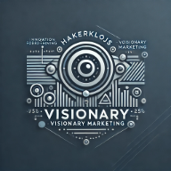

# Hakerklojs Visionary Marketing

**Hakerklojs Visionary Marketing** to zaawansowany projekt startupowy, mający na celu wsparcie przedsiębiorców i firm na każdym etapie rozwoju, poprzez nowoczesne usługi marketingu cyfrowego, tworzenie stron internetowych, oraz zaawansowaną analizę danych. Projekt ten odzwierciedla naszą misję przekształcania wizji klientów w rzeczywistość, oferując rozwiązania, które wykorzystują technologię przyszłości, taką jak sztuczna inteligencja i pamięć kwantowa.

## Misja

Naszą misją jest budowanie przyszłościowego imperium technologicznego, które będzie liderem na rynku digital marketingu i usług internetowych. Pracujemy z myślą o wspieraniu firm na każdym kroku – od startupów po globalne korporacje – oferując im narzędzia, które pozwolą osiągnąć sukces w zmieniającym się cyfrowym świecie.

## Struktura projektu

Struktura katalogów i plików została zaprojektowana z myślą o elastyczności i łatwości w zarządzaniu. Oto aktualna organizacja projektu:

- **app.py** – Główny plik aplikacji.
- **config/** – Pliki konfiguracyjne dla różnych środowisk (`development`, `production`, `testing`).
- **database/** – Pliki bazy danych oraz migracje.
- **cms/** – Moduły CMS umożliwiające użytkownikom edycję treści.
- **scss/** – Pliki SCSS dla stylów front-endowych:
  - **scss/base/** – Podstawowe style i zmienne.
  - **scss/components/** – Style komponentów.
  - **scss/layouts/** – Układy strony, np. nagłówek, stopka.
- **static/** – Zasoby statyczne:
  - **static/css/** – Wygenerowane pliki CSS.
  - **static/js/** – Skrypty JavaScript.
  - **static/images/** – Obrazy, np. logotypy i tła.
- **templates/** – Szablony HTML w Jinja2:
  - **templates/layouts/** – Główne szablony struktury strony (np. `base.html`).
  - **templates/prp_exhaust/** – Sekcja dedykowana partnerowi PRP-Exhaust.
  - **templates/pages/** – Szablony stron ogólnych, np. “O nas”, “Kontakt”.
- **tests/** – Testy jednostkowe i integracyjne dla projektu:
  - **test_app.py** – Testy aplikacji.
  - **test_config.py** – Testy konfiguracji.
  - **test_routes.py** – Testy tras i routingu.
- **ux_ui/** – Dokumentacja UX/UI, makiety, prototypy oraz specyfikacje designu.
- **.env** – Plik z wrażliwymi zmiennymi środowiskowymi.
- **requirements.txt** – Lista pakietów i zależności projektu.

## Licencja

Wszystkie prawa zastrzeżone. Kod źródłowy, struktura oraz zawartość projektu są chronione prawami autorskimi. Klonowanie, kopiowanie, modyfikacja lub dystrybucja są zabronione bez wyraźnej zgody autora. Projekt Hakerklojs Visionary Marketing jest dostępny do przeglądania, jednak **jakiekolwiek wykorzystanie bez zgody jest zabronione**. Wyłącznie zaproszeni współpracownicy mają prawo do dostępu i edytowania kodu.

## Aktualizacje i Dziennik Postępu

Informacje o postępie prac nad projektem będą publikowane w pliku **CHANGELOG.md**, zawierającym szczegóły dotyczące kolejnych etapów i osiągniętych kamieni milowych. Zachęcamy do śledzenia dziennika postępu, aby być na bieżąco z rozwojem projektu i jego kluczowymi aktualizacjami.

## Kontakt i Współpraca

## Zależności

Ten projekt korzysta z następujących bibliotek open-source, które są częścią ekosystemu Pallets:

- [Flask](https://palletsprojects.com/p/flask/) - lekki framework webowy do tworzenia aplikacji webowych. Licencja: BSD-3-Clause.
- [Jinja](https://palletsprojects.com/p/jinja/) - silnik szablonów do generowania dynamicznych HTML i innych formatów. Licencja: BSD-3-Clause.
- [Werkzeug](https://palletsprojects.com/p/werkzeug/) - biblioteka narzędziowa do tworzenia aplikacji WSGI. Licencja: BSD-3-Clause.
- [Click](https://palletsprojects.com/p/click/) - narzędzie do tworzenia łatwych i złożonych interfejsów wiersza poleceń dla Pythona. Licencja: BSD-3-Clause.
- [ItsDangerous](https://palletsprojects.com/p/itsdangerous/) - biblioteka do bezpiecznego podpisywania danych. Licencja: BSD-3-Clause.

Wszystkie te biblioteki są udostępniane na licencji BSD-3-Clause, która umożliwia ich bezpłatne używanie, modyfikowanie i dystrybuowanie, pod warunkiem zachowania informacji o autorze i licencji.

Wszelkie propozycje współpracy oraz zapytania są mile widziane. Prosimy o bezpośredni kontakt z autorem projektu, aby omówić możliwości wspólnego rozwoju Hakerklojs Visionary Marketing.

---
